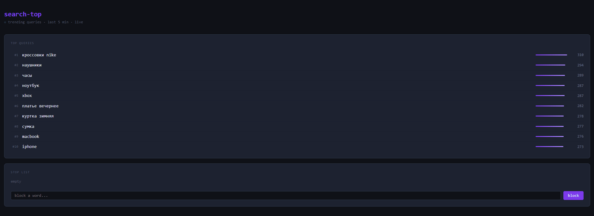
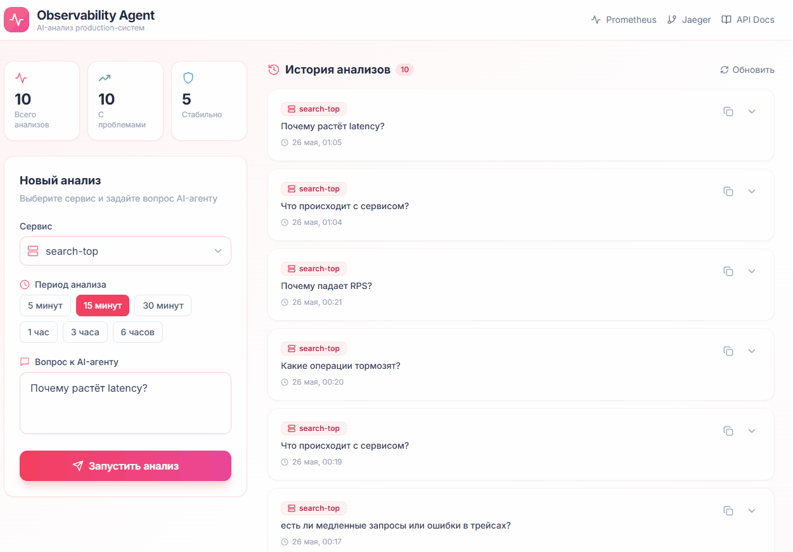

# search-top

Top-N поисковых запросов за последние 5 минут. Kafka - in-memory bucket window - pre-computed cache.

Совместим с [observability-intelligence-agent](https://github.com/Royal17x/observability-intelligence-agent).

---

## Демо

### Дашборд · стоп-лист · live обновление



### AI-агент анализирует метрики и трейсы



---

## Как это устроено

### Bucket window

5 минут - 30 бакетов по 10 сек. Каждый бакет - `map[string]int32`.  
Каждые 10 сек старейший бакет очищается.


Запись - O(1), агрегация - O(U) где U = уникальных запросов. Память фиксированная.  
Точность ±10 сек на границе окна - для виджета приемлемо.

### Pre-computed cache

Фоновая горутина пересчитывает top-N раз в секунду - `atomic.Pointer[[]Entry]`.  
Хендлер делает `Load()` - без мьютекса, без аллокаций.

### Anomaly detection

Один `user_id` + один запрос > порога - событие дропается.  
Фиксированное окно намеренно: важна скорость отсечения, не точность.

---

## Стек

| |                        |                                                        |
|---|------------------------|--------------------------------------------------------|
| Kafka | `segmentio/kafka-go`   | Чистый Go, нет CGO - работает из `scratch`             |
| HTTP | stdlib `net/http`      | Go 1.22 `{param}` routing, chi лишний для 5 эндпоинтов |
| UI | HTMX                   | Live дашборд без JS-бандла                             |
| Метрики | Prometheus             | Совместимость с observability-agent                    |
| Трейсинг | OpenTelemetry - Jaeger | Per-request latency, совместимость с агентом           |

> Redis не нужен — `atomic.Pointer.Load()` это наносекунды без сетевого round-trip.  
> Имеет смысл только при горизонтальном масштабировании.

---

## API

| Метод | Путь | |
|---|---|---|
| `GET` | `/` | HTMX дашборд |
| `GET` | `/api/v1/top?n=10` | Top-N запросов (JSON) |
| `GET` | `/api/v1/stoplist` | Стоп-лист |
| `POST` | `/api/v1/stoplist` | Добавить `{"word":"..."}` |
| `DELETE` | `/api/v1/stoplist/{word}` | Удалить |
| `GET` | `/metrics` | Prometheus |
| `GET` | `/healthz` | Health check |

```bash
curl "http://localhost:8080/api/v1/top?n=3"
```

```json
{
  "items": [
    {"query": "кроссовки", "count": 302},
    {"query": "куртка",    "count": 293}
  ],
  "total": 2
}
```

---

## Контракт события

```json
{
  "query":     "кроссовки",
  "user_id":   "u-9f3a1c",
  "timestamp": "2024-05-26T14:32:00Z"
}
```

`user_id` - только для anomaly detection, в топ не попадает.  
`timestamp` - время источника, не брокера. Старше 5 мин - drop.

---

## Быстрый старт

```bash
git clone https://github.com/Royal17x/search-top && cd search-top
cp .env.example .env
docker compose up -d
go run cmd/seed/main.go   # тестовые данные
```

**http://localhost:8080** - дашборд  
**http://localhost:16687** - Jaeger

---

## Нагрузочный тест

```bash
go run cmd/loadtest/main.go
```

```
kafka:  5000 events   -  86ms
api:    500/500 OK    - 124ms  |  avg 4.8ms

#1  телефон   302
#2  airpods   295      - бот слал "кроссовки" 100 раз,
#3  куртка    293         anomaly detector отсёк
```

---

## Observability + AI-агент

Метрики на `/metrics`, трейсы в Jaeger на `:16687`.

Чтобы подключить [observability-intelligence-agent](https://github.com/Royal17x/observability-intelligence-agent), добавь в `metrics_config.yaml`:

```yaml
search-top:
  rps:    'rate(search_top_requests_total[{range}])'
  p99:    'histogram_quantile(0.99, rate(search_aggregate_duration_seconds_bucket[{range}]))'
  errors: 'rate(search_events_dropped_total[{range}])'
```

Агент ответит на: *«что происходит с search-top?»*, *«есть ли аномалии?»*

---

## Структура

```
search-top/
├── assets/
├── cmd/
│   ├── loadtest/
│   │   └── main.go
│   ├── seed/
│   │   └── main.go
│   ├── server/
│   │   └── main.go
│   ├── stoplist/
│       └── main.go
├── internal/
│   ├── anomaly/
│   │   ├── detector.go
│   │   └── detector_test.go
│   ├── api/
│   │   ├── middleware.go
│   │   ├── server.go
│   │   ├── stoplist.go
│   │   ├── top.go
│   │   └── ui.go
│   ├── config/
│   │   └── config.go
│   ├── consumer/
│   │   ├── event.go
│   │   └── kafka.go
│   ├── metrics/
│   │   └── metrics.go
│   ├── stoplist/
│   │   ├── stoplist.go
│   │   └── stoplist_test.go
│   ├── tracing/
│   │   └── tracing.go
│   ├── window/
│       ├── cache.go
│       ├── ranker.go
│       ├── window.go
│       └── window_test.go
├── Dockerfile
├── Makefile
├── README.md
├── docker-compose.yml
├── go.mod
├── go.sum
└── prometheus.yml
```